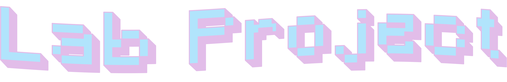

<picture>
  <source media="(prefers-color-scheme: dark)" srcset="assets/lab-project-dark.png">
  <source media="(prefers-color-scheme: light)" srcset="assets/lab-project-light.png">
  
</picture>

**Welcome to the Final Lab Project of Computer *Vision I* at Comillas ICAI**.  
This repository contains the complete implementation of a **classical computer vision system in real time**, developed as part of the final project of the course 📷💻.

The project integrates **camera calibration**, **pattern-based visual security**, and a **tracking system using a Kalman filter**, without relying on Deep Learning techniques. Everything is built on classical computer vision: HSV color spaces, thresholding, morphological operations, contour detection and polygonal approximation.

---

## ⚙️ How it works

The system runs on a webcam and is made up of three blocks:

- **Camera calibration.** From a set of chessboard images, the intrinsic matrix and the distortion coefficients of the camera are computed and stored.
- **Visual password (a color-and-shape "lock").** The application only unlocks when a specific sequence of colored shapes is shown to the camera.
- **Basketball mode with Kalman tracking.** Once unlocked, a pink ball is detected by color and tracked with a Kalman filter to referee shots into a target, keeping a live count of makes, attempts and misses.

---

## 📦 Requirements

- Python 3.10 or higher
- A webcam
- Python dependencies:

```bash
pip install opencv-python==4.8.0.76 numpy imageio
```

For the basketball mode you also need, in the physical world:

- A ball (or any object) in a strong pink color.
- A bin, box or similar object to act as the basket.
- A phone or screen to display the color shapes of the lock (red circle, triangle, green square and magenta star).

The HSV color ranges are tuned to the specific objects and lighting we used in the lab, so you may need to adjust them in the code for your own setup (see the notes below).

---

## 🎯 Camera calibration

The script `src/camera_calibration.py` calibrates the camera from the ten chessboard images stored in `data/`. It detects the inner corners of the board (7×9, 20 mm squares), refines them, computes the intrinsic parameters and distortion coefficients, and saves them to `data/camera_calibration_params.npz`. It also writes the images with the detected corners drawn on them into `imagenes_con_marca/`.

The script uses relative paths (`../data/`), so it must be run from inside the `src/` folder:

```bash
cd src
python camera_calibration.py
```

It shows each marked image one by one; press any key to move to the next one. When it finishes it prints the intrinsic matrix, the distortion coefficients and the reprojection error (RMS).

---

## 🏀 Main program

The script `src/script_principal.py` is the real-time application. It runs directly on the webcam (camera 0 by default, at 1280×720):

```bash
cd src
python script_principal.py
```

It works in two phases.

### Phase 1 — Visual password

On startup a blue box appears in the top-left corner. Inside that box you must show, using a phone or a screen, four colored shapes in this order:

1. Red circle
2. Triangle
3. Green square
4. Magenta star

Each shape is detected by combining its color (an HSV mask) and its shape (number of vertices of the contour approximation, plus a circularity criterion to tell circles and stars apart). If you complete the full sequence, basketball mode is unlocked. If you make a mistake, the sequence resets to the beginning.

### Phase 2 — Basketball mode with Kalman tracking

Once unlocked, the program detects the pink ball by color and estimates its position with a Kalman filter (position and velocity state), so it keeps predicting the trajectory even when the ball is briefly lost.

Before playing you have to mark two regions with the mouse:

- Press `b` and select the basket (the target bin) with the mouse.
- Press `t` and select the point from which the shot is taken.

From then on the system keeps score: a shot starts when the ball leaves the shooting point, and it counts as a make if the estimated position stays inside the basket for at least 15 consecutive frames; if the ball returns to the shooting point without scoring, it counts as a miss. Makes, attempts, misses and FPS are shown on screen.

Controls:

| Key | Action |
|-----|--------|
| `b` | Select the basket (target) |
| `t` | Select the shooting point |
| `r` | Reset the counters |
| `q` or `Esc` | Quit |

---

## 📁 Resources

This laboratory project contains the following elements:

- 📄 **Guide**: A `PDF` file with the official project description and requirements.
- 💻 **Scripts**: Python scripts implementing the full system.
- 🎞️ **Data**: Calibration images and stored calibration parameters.
- 🖼️ **Assets**: Images used for documentation and repository styling.
- 📖 **README**: This file, describing the project structure and functionality.

---

## 🗂️ Project structure

The repository is organized as follows:

```bash
.
├── assets
│   ├── lab-project-dark.png
│   └── lab-project-light.png
│
├── data
│   ├── calibration_00.jpg
│   ├── calibration_01.jpg
│   ├── ...
│   ├── calibration_09.jpg
│   └── camera_calibration_params.npz
│
├── imagenes_con_marca
│   ├── calibration_00_marked.jpg
│   ├── ...
│   └── calibration_09_marked.jpg
│
├── src
│   ├── camera_calibration.py   # Camera calibration from the chessboard images
│   ├── script_principal.py     # Real-time application (lock + basketball mode)
│   └── test.py                 # Tests
│
├── Lab_Project.pdf
└── README.md
```

---

## 📝 Notes

- The HSV color ranges (`detectar_pelota_rosa` and `detect_colored_shapes` in `script_principal.py`) are tuned to our objects and lighting. If detection does not work well, adjust the `lower`/`upper` values to your own material.
- The camera image is shown mirrored (`cv2.flip`), which makes it easier to place the objects in front of the webcam.
- Calibration and the main program are independent: basketball mode works directly on the webcam image and does not apply the distortion correction stored in the `.npz` file.

---

## Author

Guillermo Ruiz de Azúa — Bachelor's Degree in IMAT, ICAI (Universidad Pontificia Comillas).
